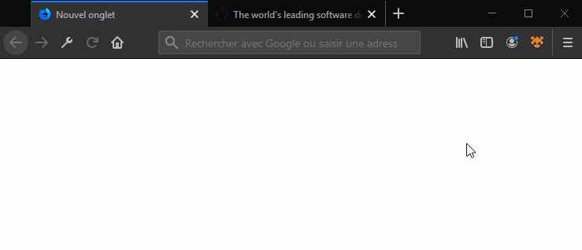

# Lisi
A simple self-hosted online bookmark system entirely integrated to the browser (web extension).

This project aims to help you save and organize interesting web pages to read them later.

## Still under Development...
It is not functional yet. Account management (subscription / connection) is almost done and most security features have been implemented (double hmac, bcrypted passwords, etc.).

The client has been tested on Firefox only. I'm still working on it :)



## Usage
Server:
```
cd server
npm install
npx sequelize db:migrate
npm start
```
Client: (requires firefox for development)
```
cd client
npm install
npm start
```
